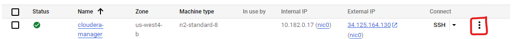
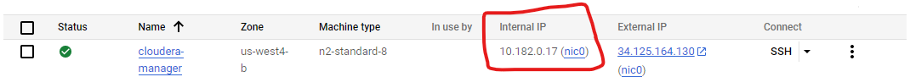

# Hadoop Core Cluster Configuration


## Pros

- Easy to install.
- Good for running and debugging purposes.
- Beginner friendly.
- Setup does not take much time, some can focus on logic and application development.
## Cons:
- Cannot handle large set of data.
- One cannot experience cluster-based architecture.
## Deployment

Follow below steps for configuration 

- Create a GCP account.
- Enable VM instance API: API & Services -> Enable API & Services -> First time it will ask to enable VM Instances
- An VM instance will be created under Compute Engine -> VM Instances
- Go to Create Instance (this will be our master node) -> Here specify the configuration for Image:
- **Name**: User Defined
- **Region and Zone**: Location near to User as per requirement
- **Machine configuration**: N1
- **Machine Type**: n1-standard-4 (we can choose this as per project requirement, in our case we are handling huge amount of data, so we chose 4 virtual CPUs)
- **Change Boot disk configuration**: (User centric)
- **Operating System**: CentOS
- **Boot Disk Type**: Standard Persistent disk
- **Allow Firewall**: Allow HTTP traffic and Allow HTTPS traffic, in order to access Cloudera Manager UI.
- **Advanced options**: Not required in our case.
- Create instance by clicking on "create.” 
- Connect to the newly created instance through **SSH** and follow bellow steps.


Change the password for root user and save the password for later purpose
```bash
sudo passwd
```
Change Directory
```bash
cd /
```
Login to root user
```bash
su root
```
Now run bellow commands one by one.

```bash
sudo systemctl disable firewalld
```
```bash
vi /etc/selinux/config
```
you will get below lines open in editor
```bash

# This file controls the state of SELinux on the system.
# SELINUX= can take one of these three values:
#     enforcing - SELinux security policy is enforced.
#     permissive - SELinux prints warnings instead of enforcing.
#     disabled - No SELinux policy is loaded.
SELINUX=disabled # change this disabled if it is set to enforcing 
# SELINUXTYPE= can take one of three values:
#     targeted - Targeted processes are protected,
#     minimum - Modification of targeted policy. Only selected processes are protected. 
#     mls - Multi Level Security protection.
SELINUXTYPE=targeted
```
```bash
echo "never" > /sys/kernel/mm/transparent_hugepage/enabled
```
```bash
file=/etc/ssh/sshd_config
```
```bash
cp -p $file $file.old && awk ' $1=="PermitRootLogin" {$2="yes"} $1=="PasswordAuthentication" {$2="yes"} $1=="PubkeyAuthentication" {$1="PubkeyAuthentication"} {print} ' $file.old > $file
```
```bash
yum install ntp -y
```
```bash
systemctl start ntpd
```
```bash
systemctl enable ntpd
```
```bash
vi /etc/sysctl.conf
```
It will open sysctl.conf file. Now add the below line and save it.
```bash
vm.swappiness = 10
```
Now install all necessary tools which help in installing the Python
```bash
yum install gcc openssl-devel bzip2-devel libffi-devel zlib-devel make -y
```
```bash
cd /opt/
```
```bash
curl -O https://www.python.org/ftp/python/3.8.12/Python-3.8.12.tgz
```
```bash
tar -zxvf Python-3.8.12.tgz
```
```bash
cd /opt/Python-3.8.12
```
```bash
./configure --enable-shared --prefix=/usr/bin
```
```bash
make install
```
```bash
cp --no-clobber ./libpython3.7.so* /lib64/
```
```bash
chmod 755 /lib64/libpython3.7.so*
```
```bash
export LD_LIBRARY_PATH=$LD_LIBRARY_PATH:/usr/local/lib/
```
**Now we are ready to create a machine image which will be our custom os for our project**

Close the SSH connect and follow below steps

Click the edit button for your Vm instance



Select "Create New Machine Image" option
- you can find created image under Compute Engine -> Machine Image 

**We will use this image to create our data nodes by following below steps:**
- Clicking on 'Create Instances' on top of "VM instances" page.
- Choose option "New VM Instance from Machine image.”
- Choose a newly created machine image. Repeat this process to create as much as data nodes needs to be created (we created three)

Connect to the created nodes using SSH and follow the below steps in sudo mode to make an entry for all your servers in /etc/hosts:
```bash
vi /etc/hosts
```
It will open a editor with known hosts address. As we are in "cloudera-manager" instance we can see it's address registered in the file.

In the same format, register other 3 datanode's in this file.

```bash
<Internal-Ip-Address of datanode> <hostanme of datanode> <Alias name>
```
My alias name for datanodes are datanode-1, datanode-2, datanode-3

**Internal Ip Address can be found in GCP alongside of your instance name**



You can get the hostname by running the below command.
```bash
hostname -f
```
Run the above command in each datanode to get their hostnames.

**Now we have to establish a connection between masternode and datanodes**
Connect to Master Node using SSH and login as a root user (sudo) and
execute the commands below.

```bash
ssh-keygen -t rsa
```
It will ask you for folder and password. Just press enter for everything to keep it simple.

Now copy the id_rsa.pub from master vm to all other data node vm

Follow the below commands in master vm to do above process.

```bash
sudo ssh-copy-id -i ~/.ssh/id_rsa.pub root@datanode-1
sudo ssh-copy-id -i ~/.ssh/id_rsa.pub root@datanode-2
sudo ssh-copy-id -i ~/.ssh/id_rsa.pub root@datanode-3
```

Download the latest Cloudera Manager using below command

```bash
wget https://archive.cloudera.com/cm7/7.4.4/cloudera-manager-installer.bin
```
After downloading, we will get a bin file (cloudera-manager-installer.bin).
User must give execute permission for this file, run the below command to
do so:

```bash
chmod u+x cloudera-manager-installer.bin
```
At last run the below command to insyall the Cloudera-Manager
```bash
sudo ./cloudera-manager-installer.bin
```
## Note:

**You can follow the screenshots in Screenshots folder to follow after above command**
